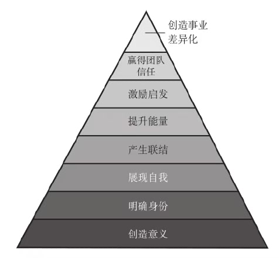
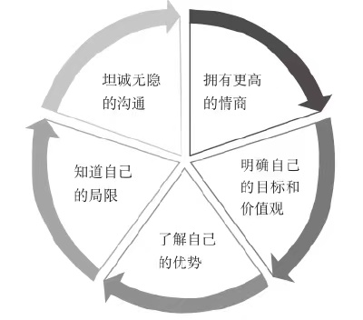
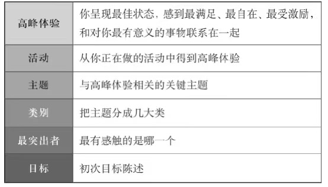
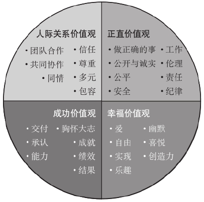

# 目标
## 目标的八大非凡益处

```
感悟：

目标也是一种“少”的艺术,也是为了追求“简洁”。

```

---






## 如何确立个人目标和团队目标

1. 发现个人目标的七个关键原则

2. 在“高峰时刻”中感受个人目标

3. 确立个人目标的具体步骤

确定目标的具体步骤如下：
1.记下你这辈子的高峰瞬间，那些展现了你自己最佳状态、最为充实、乐在其中的时刻。
2.回想过去发生过的事情，哪些活动让你念念不忘，例如：旅游、运动、工作、创意发挥、慈善活动或人际交往。
3.确认那些高峰体验的关键主题，例如：自由、学习、奉献、创新、实现。
4.将主题分成几大类，例如：明确成果、帮助他人、实现变革，等等。
5.选定一个你最有触动的类别。
6.找一位你可以信赖的伙伴，以下列问题帮助你深入探索上述选定的主题：
A.那个主题对你有什么意义？为什么？
B.你会如何实现这个主题？
C.那个主题的终点是什么？
D.如果实现了自己的主题，会为你带来什么不同？
7.让伙伴把他刚刚听到，可能是你目标的主题，汇整成一个问题向你提问：“那么可以说，你的目标就是？”
8.设定目标陈述：明确说出这个目标对你有什么意义。

目标架构：



4. 用价值观给个人目标赋能

   

5. 确立团队目标的5个问句

6. 如何让团队目标激发个体行动

## 培养目标心态，改善当下现状

想要“拥有”什么东西，必须去“行动”，做我们要做的事，然后才能“成为”我们理想中的那种人（“存在”）。但这是颠倒的错误思考。


先成为你理想中的那种人，再让它来塑造和影响你的行动和所得。


---

在二十世纪中，发现“刺激”和“反应”之间还有一个“选择”，可能是心理学界的最大突破。

---

将任务变成意图

---

目标领导的步骤：


戴维的例子：


## 培养目标技能，促进目标实现

卓有成效的六大目标技能


1. 倾听，有效共情

   * 倾听技巧
     * 
   * 倾听层次
     * 
2. 讲故事，争取认同
   * 把故事讲好，需要6种技巧
     1. 明确你的目标
     2. 真心诚意
     3. “三”点原则
        * 分享三个关键主题来说明你的目标或选择方向
     4. 故事必须简短
     5. 运用创意
     6. 练习
3. 教练，强化领导
   * 教练技术：苏格拉底式问答
   * 教练技术：假设大家心中其实都有自己的答案，经过一问一答的探索过程，刺激对方深入地反复思考，解决方案就会浮现出来。
   * 教练技术的假设：绩效=潜力-干扰
   * 出色的教练是把答案从对方那里“引导”出来，而不是“逼迫”他们服从。
   * 诱导训练技能：
     * 存在
     * 行动
       * GROW模型
         * 目标：定义对话的主题和具体结果
         * 现实：探索成功的模型，找出应该弥补的差距
         * 选项：创造各种可能性来解决问题
         * 总结：测试选项、选定确切行动
     * 关系
4. 反馈，激励改变
   * 4:1规定，1个负面反馈必须得到4个正面评价来平衡
   * 反馈必须具体、及时，并且是针对行为
5. 人际关系，发挥影响力
   * 没有人际关系，就没有领导力
   * 建立符合目标的人际关系之关键技能
     1. 定义每段关系的成功模型
     2. 更懂得包容
     3. 设定明确的期望
     4. 沟通、沟通、再沟通
     5. 欣赏与赞扬
   * 人际关系7阶段：
6. 提升专注力，把握关键
   * 少即是多

## 把目标化为动力，成功改变人生

领导力的核心是：真诚实在

真实领导的另一个重要元素是怀抱同情心

目标华为行动：


领导风格：领导风格主要有五种，领导者必须在不同状况下灵活运用。


增强耐力的四个方面：

联结型领导：

成功职业生涯：

幸福转轮：


## 架构范例

个人目标架构：


团队目标架构：


组织目标架构：


